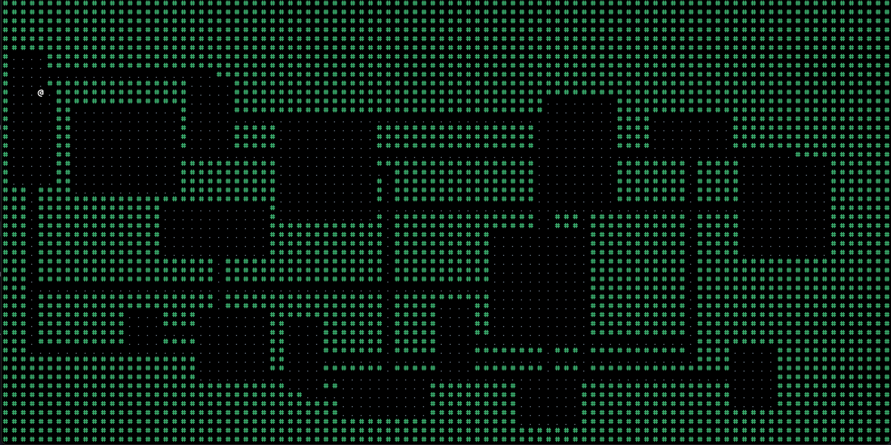
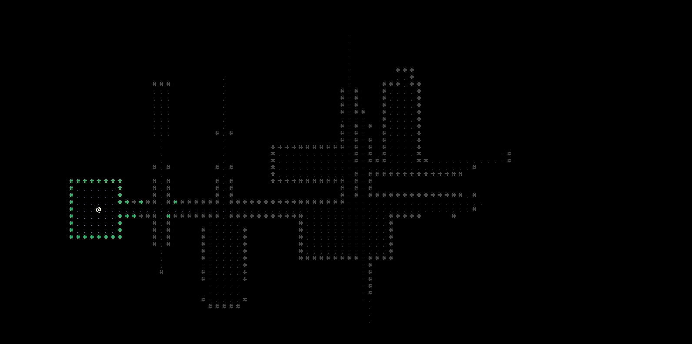

A repo for the parts of the Haskell roguelike tutorial available at https://ppkfs.github.io. Each part of the tutorial is fully contained and iterative. Individual parts on their own are available in individual branches (thanks, `git-subrepo`!).
The structure of the parts has been shamelessly borrowed from the *fantastic* Rust+`rltk/bracket` tutorial available [here](https://bfnightly.bracketproductions.com/).
- Section 0: Before we begin...
  - Part 0.0 - Setting up the project. Printing a character to the screen.
- Section 1: The base game.
  - Part 1.1 - Moving around with the keyboard. `mtl`.
**--- this is up to where the written tutorial parts end. ---**
  - Part 2 - Making some various basic maps. Better module organisation.
  
  - Part 3a - Introducing game objects and the `Rogue.Objects` modules. Hitting the edge of dealing with 'vanilla' Haskell.
**--- this is up to where the code has been reviewed and neatened up. ---**
  - Part 3b - Introducing `optics` - finally a solution to how awkward it is to do nested record updates (and state updates!).
  - Part 4 - Field of view and exploration.
  
  - Part 5 - Monsters, pathfinding, and diagonal movement.
  
**--- this is up to where the code has been finished. ---**
  - Part 6 - Combat, killing things, getting killed. Modelling inputs as actions and events.
---

everything after this part is the roadmap!

---
- - Part 7 - UI and info panels. Message logs. A camera separate from the map. Mouse support and tooltips.
  - Part 8 - Items, inventory, making spawning more interesting. Using/picking up/dropping things.
  - Part 9 - Ranged damage and scrolls. Targeting. Status and AoE effects.
  - Part 10 - Saving/Loading. Adding a title screen. More levels. Bigger levels.
  - Part 11 - Difficulty and waiting. More enemy variety. Bosses.
  - Part 12 - Equipment and armour. An "end" and a game over screen.
- Section 2: Making it prettier.
  - Part 2.1 - Graphical tilesets. Making walls appear connected.
  - Part 2.2 - Bloodstains, particle effects, animations. Decoupling
  - Part 2.3 - Hunger and food. Magic mapping.
  - Part 2.4 - Support for REXPaint and making a prettier game menu.
  - Part 2.5 - Traps. Tile entities (water and lava and suchlike).
- Section 3: Improving the map generators.
  - Part 3.1 - Making a general map framework to plug'n'play different generators.
  - Part 3.2 - Generating dungeons and interiors with BSP (Binary Space Partitioning).
  - Part 3.3 - Cellular automata and the drunkard's walk.
  - Part 3.4 - Labyrinths and mazes.
  - Part 3.5 - Overworld and chunking for large spaces.
  - Part 3.6 - Minimaps.
  - Part 3.7 - Prefabs and hand-designed rooms.
  - Part 3.8 - Nicer corridors. Doors. Keys and locks.
- Section 4: Polishing and expanding the world.
  - Part 4.1 - Data-driven Design (DDD). Loading object definitions from files.
  - Part 4.2 - A town. Buildings. A story.
  - Part 4.3 - Populating the town. Chatter. NPCs. Talking.
  - Part 4.4 - Adding RPG stuff. Stats. XP. Levelling.
  - Part 4.5 - Making a forest. Making caves.
  - Part 4.6 - Teleportation. Quests.
  - Part 4.7 - More items. More monsters. More variety. More *stuff*.
  - Part 4.8 - Supporting different fonts. Multi-tile objects.
---
Some other things I think would be useful to cover but haven't decided on yet.

---

- - Sound
  - Testing
  - Debugging support
  - Profiling and optimisation
  - GUI elements
  - Configuration